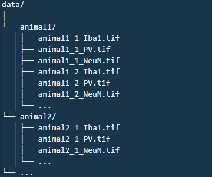

# MicroNeuSeg

**MicroNeuSeg** is a Python-based pipeline designed to perform spatial analysis of microglia and neurons in mouse brain imaging data. The pipeline processes 3 image channels—Microglia (cx3cr1gfp or Iba1), PV, and NeuN—and outputs the spatial coordinates of detected cells, enables region-of-interest masking, and allows the analysis of their relative spatial distributions.

---

## 📋 Data Setup and Folder Structure

The pipeline expects data organized as follows:

Each subfolder represents an animal and contains TIFF images named with the following format:

<animal_name>_<section_number>_<marker>.tif

Markers should explicitly be named: Iba1, PV, or NeuN, though the code is not case sensitive.

## 🚀 Features

The pipeline consists of sequentially numbered scripts to be executed in order:

1. **0_segment_single_folder.ipynb** *(Optional but recommended)*
   - Tests segmentation configuration on data from a single animal folder - use "animal1" folder path as defined in the Data Setup and Folder Structure chapter.
   - Useful for interactive parameter adjustments via `config.py`.
   - Start with this to broadly set up the segmentation
   - all my parameters for segmentation and extraction of the data have been optimized with a pixel size of circa 0.75 micron

2. **1_segment_all_folders.ipynb / 1_segment_all.py**
   - Performs segmentation simultaneously across all animal folders - use "data" folder path as defined in the Data Setup and Folder Structure chapter.
   - Interactive visualization recommended via notebook version (`.ipynb`).
   - inside each animal folder you will now find the output_csvs folder containing all coordinates of cells

3. **2_masking.ipynb**
   - Allows manual masking to define a specific region of interest (ROIs).
   - This is mandatory as this pipeline was constructed to analyze a mouse cortex, so there is a need to cut away empty parts of the images and also subcortical stuff... see the data folder for some sample images
   - inside each animal folder you will now find the masks folder containing all masks 1 per image (the three channels of course share the mask)

4. **3_filter_all_folders.ipynb** 
   - Uses the mask drawn in 2 to filter the data coordinates from the segmentation
   - inside each animal folder you will now find the filtered_csvs folder containing all coordinates of all cells filtered to be within the mask drawn in 2_.ipynb

5. **4_extract_data.ipynb** 
   - This is the code that does the "data analysis"
   - It will output an excel file per section analyzed of all mice
   - all my parameters for extraction of the data have been optimized with a pixel size of circa 0.75 micron
   - if the parameter visualize is set to True it will also save images to check the analysis - so segmentation results, association results and synthetic dataset creation
   - you can see the example analysis of animal1_1 in the results folder
### Parameters Extracted (per section)

Each `.xlsx` file generated by the analysis includes the following parameters for the masked region of each brain section:

| Parameter | Description |
|----------|-------------|
| **Area** | Area of the manually defined region of interest (ROI) in mm². |
| **Microglia_Density** | Number of Iba1⁺ microglia per mm² within the ROI. |
| **PV_Density** | Number of PV⁺ interneurons per mm² within the ROI. |
| **NeuN+PV-_Density** | Density of NeuN⁺ PV⁻ cells. |
| **NeuN_Density** | Total number of NeuN⁺ neurons per mm². |
| **Perc_Microglia_associated_PV_Observed** | Percentage of PV⁺ cells with at least one microglia within the specified threshold distance (e.g., 15 px). |
| **Perc_PV_associated_Microglia_Synthetic** | Same as above, but using a synthetic distribution of microglia to test for spatial association. |
| **Average_Nearest_Distance_PV_to_microglia_Observed** | Mean distance (in µm) between each PV⁺ cell and its closest microglia. |
| **Average_Nearest_Distance_PV_to_microglia_Synthetic** | Mean distance (in µm) for the same analysis using synthetic microglia coordinates. |
| **Perc_Microglia_associated_NeuNPV_Observed** | Percentage of NeuN⁺PV⁻ cells with at least one microglia within threshold. |
| **Perc_Microglia_associated_NeuNPV_Synthetic** | Same as above, with synthetic microglia coordinates. |
| **Average_Nearest_Distance_NeuNPV_to_microglia_Observed** | Mean distance (in µm) between each NeuN⁺PV⁻ cell and its closest microglia. |
| **Average_Nearest_Distance_NeuNPV_to_microglia_Syntetic** | Mean distance (in µm) for the same using bootstrapped coordinates. |
| **Perc_PV_associated_Microglia** | Percentage of Iba1⁺ cells that are close (within threshold) to at least one PV⁺ cell. |
| **Average_Nearest_Distance_microglia_to_PV** | Mean distance (in µm) between Iba1⁺ cells and their closest PV⁺ cell. |
| **Perc_NeuNPV_associated_Microglia** | Percentage of Iba1⁺ cells close to at least one NeuN⁺PV⁻ cell. |
| **Average_Nearest_Distance_microglia_to_NeuNPV** | Mean distance (in µm) between Iba1⁺ cells and their closest NeuN⁺PV⁻ cell. |
| **E_I_ratio** | This is a derivative parameters which is (Perc_NeuNPV_associated_Microglia-Perc_PV_associated_Microglia)/(Perc_NeuNPV_associated_Microglia+Perc_PV_associated_Microglia) |

---

## ⚙️ Installation & Requirements
**My personal suggestions is to first install stardist and tensorflow using their installation guidelines, the rest you can easily add later when you run the script**

### Prerequisites

- Stardist and TensorFlow environment ([installation guide](https://github.com/stardist/stardist))

### Other Python Libraries

- `scikit-image`
- `opencv-python`
- `pandas`
- `numpy`
- `matplotlib`
- `seaborn`

## 📄 License
This project is licensed under the GPL-3.0 license
